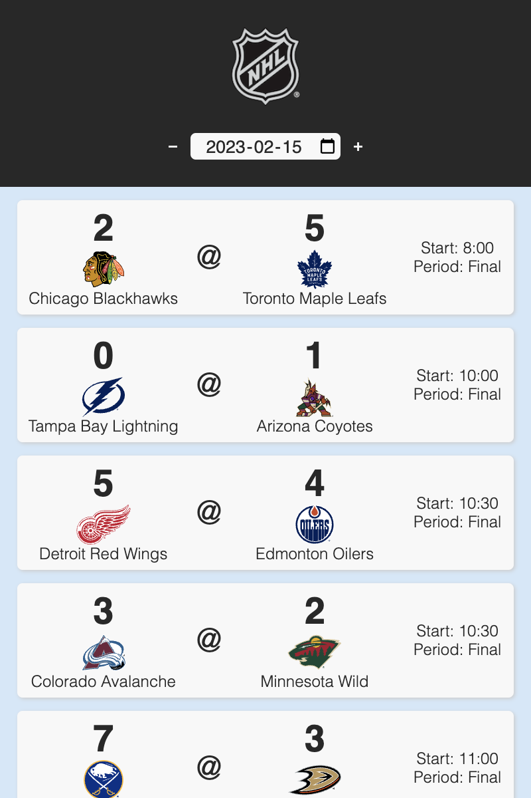
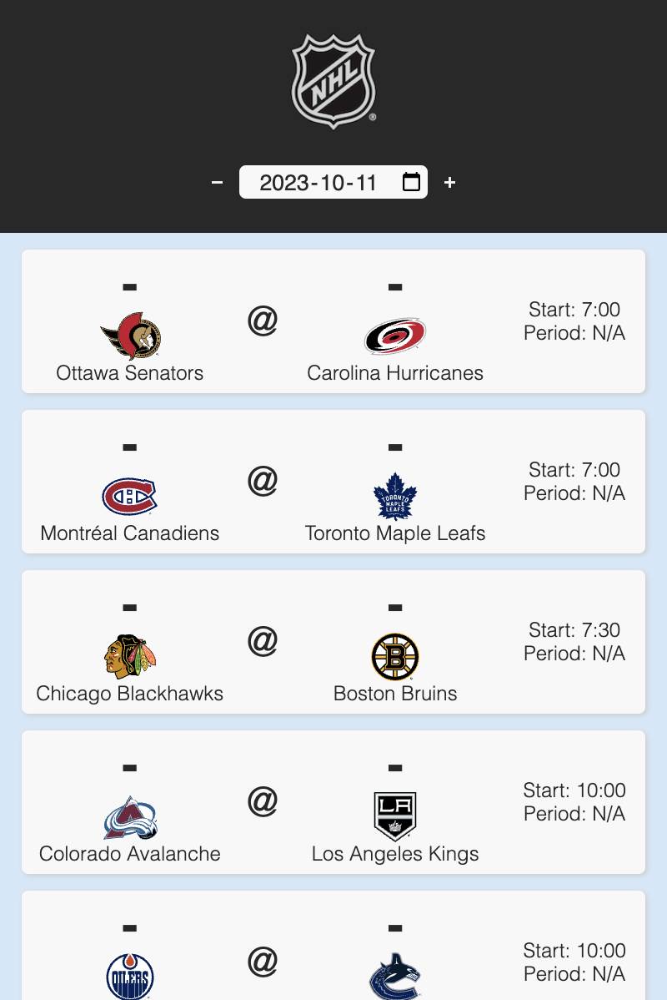

# NHL Chrome Extension

#### A Chrome extension that shows concise NHL game data for including past games, upcoming game times, and current scores..

## Download Link

#### Coming Soon

## Credits

Shout out to [Drew Hynes](https://github.com/dword4) for [his work documenting the NHL API](https://gitlab.com/dword4/nhlapi) and of course to the NHL for providing the API.
